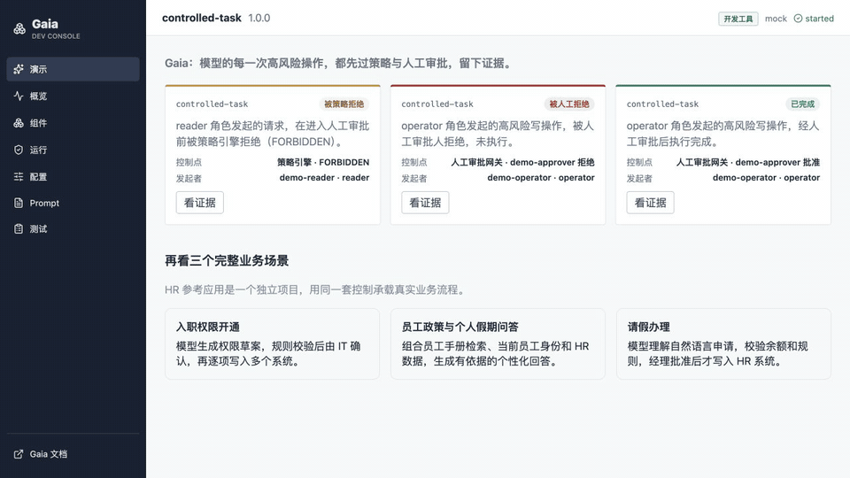
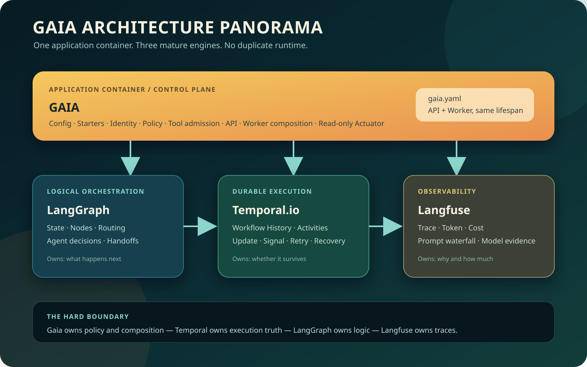

<div align="center">


# Gaia

### 企业 Agent 的受控执行与交付底座

让会调用工具、修改业务数据的 AI 应用，在身份、策略、人工审批、持久执行与审计证据的边界内运行。

[](https://github.com/tankyhsu/gaia/actions/workflows/gaia-ci.yml)
[](https://tankyhsu.github.io/gaia/)
[](https://www.python.org/)
[](#项目状态与边界)

[在线文档](https://tankyhsu.github.io/gaia/) ·
[快速体验](#快速体验) ·
[开发指南](developer-docs/developer-guide.md) ·
[架构全景](developer-docs/architecture.md) ·
[部署方式](developer-docs/runtime-profiles.md)

</div>

---

Gaia 面向企业 Agent 应用开发者、平台工程师和交付工程师。业务应用提供模型、场景、工具与规则；
Gaia 负责把它们装配到统一的执行边界中，并回答五个生产问题：

1. **谁发起了这次操作？**
2. **为什么允许或拒绝？**
3. **高风险动作是否在执行前得到可信审批？**
4. **等待、重试或进程故障后能否继续？**
5. **事后能否还原当时的版本、决定和执行证据？**



## 核心能力

- **受控写入**：统一检查身份、组织、角色、风险、环境写入上限、工具白名单与 Adapter 定义，
  再决定执行、拒绝或进入 HumanGate。
- **持久执行**：生产环境使用 Temporal.io 承载 Workflow History、Activity、Update、重试、等待与
  Worker 故障接管；LangGraph 专注 State、节点与逻辑路由。
- **可信证据**：Run、事件、Gate、工具结果、模型调用和版本信息进入统一审计投影，Console、API、
  Actuator 与诊断包读取同一份事实。
- **声明式装配**：通过 `gaia.yaml`、Profile、Starter 与 Python 原生生命周期装配 API、Worker、
  数据库、模型、Prompt、RAG、Guardrails 和可观测性组件。
- **企业集成边界**：内置 API Key 与 OIDC/JWT 认证入口，支持 PostgreSQL、Redis、pgvector、
  OpenAI-compatible 模型与 Embedding、Langfuse、Guardrails AI 等 Integration。
- **可验证交付**：CLI 检查、Test Kit、攻击演示、Temporal History Replay、真实 PostgreSQL/Redis
  集成测试、前端 E2E 和生产形态故障验收共同约束交付结果。

## Gaia 解决什么问题

| 企业 Agent 的风险 | Gaia 提供的机制 |
| --- | --- |
| 模型直接调用高风险写工具 | 工具准入、策略检查、执行前 HumanGate |
| 请求体伪造身份或角色 | 服务端认证身份、组织归属与资源访问控制 |
| 审批需要等待数小时或数天 | Temporal Workflow 持久等待与可信 Update |
| API 或 Worker 重启导致任务丢失 | Workflow History、Activity Retry 与故障恢复 |
| Prompt 或规则改变后无法解释旧结果 | 精确版本固定、内容指纹与运行证据 |
| 多套组件实际运行配置不一致 | API/Worker 共用 Application composition 与 lifecycle |
| 出现问题只能翻技术日志 | 面向 Run 的状态、决策、工具和模型证据视图 |

## 接入方式

| 场景 | 入口 |
| --- | --- |
| Python 应用 | `@scenario`、`@read_tool`、`@write_tool` 与公开 Python API |
| LangGraph 应用 | 通过窄 `ScenarioRunner` 边界接入现有 Graph，不重写业务编排 |
| Java、Go、TypeScript 等服务 | HTTP API、SSE 事件流与 OpenAPI 契约 |
| 本地开发与调试 | Gaia CLI、Dev Console、Actuator、诊断包与 Test Kit |
| 企业生产部署 | Helm/Kubernetes、独立 API/Worker、外部 Temporal 与 PostgreSQL |

## 运行与部署

Gaia 把“Run 如何执行”和“整套服务怎样启动”分开。生产环境必须使用 Temporal；`in_process`
只用于开发、测试和单机 PoC。

| 方式 | 适用场景 | Temporal | 主要入口 | 生产用途 |
| --- | --- | --- | --- | --- |
| `in_process` | 单元测试、自动化测试、低风险 PoC | 不需要 | 应用自己的 API | 否 |
| `make demo` | 第一次体验、确定性演示 | 自动启动一次性 Server 和 Worker | Console `4180/#demo` | 否 |
| 日常开发 | 修改 Scenario、Runtime 或 Console | 显式启动本地 Server 与 Worker | API `8000`、Console `4173` | 否 |
| `make dev-full` | 完整基础设施和 HR Showcase 联调 | Compose 管理 | Gateway `4181` | 否 |
| `make prod-up` | 本地生产形态与故障验收 | Compose + PostgreSQL | API Gateway `8088` | 否 |
| Helm/Kubernetes | 企业 customer 环境 | 必须外部提供或平台管理 | 企业 Ingress / Gateway | **是** |

完整区别见[选择运行与部署方式](developer-docs/runtime-profiles.md)。

## 快速体验

### 环境要求

- macOS 或 Linux；
- Python `3.12`；
- [uv](https://docs.astral.sh/uv/)；
- Node.js `22`；
- Docker 仅在 `dev-full`、Production-like 或基础设施 Profile 中需要。

### 一条命令看到受控执行

```bash
git clone https://github.com/tankyhsu/gaia.git
cd gaia
make setup
make demo
```

启动完成后打开：

```text
http://127.0.0.1:4180/#demo
```

演示会创建独立数据库并预置三条真实运行：

- 高风险写操作经人工批准后完成；
- 高风险写操作被人工拒绝；
- 跨组织请求在触达人工前被策略拒绝。

选择任意 Run 后，可逐项查看生效策略、审批身份、工具调用和最终结果。`Ctrl+C` 会停止本次演示
启动的进程；演示使用独立端口和 `var/gaia-demo*.db`，不会触碰日常开发数据库。

如果要从业务函数开始写应用，继续阅读：

- [20 分钟走通 Gaia](developer-docs/getting-started.md)
- [Gaia 应用开发 Quick Start](QUICKSTART.md)
- [最小函数式示例](examples/function_task/README.md)
- [三个企业场景](developer-docs/try-it.md)

## 架构



| 系统 | 负责什么 | 不负责什么 |
| --- | --- | --- |
| **Gaia** | 应用装配、身份、策略、工具准入、API/Worker composition、审计投影 | 不重新实现 Workflow、模型 SDK 或业务系统 |
| **LangGraph** | State、节点、条件路由、Agent 决策与 Handoff | 不承担生产级任务所有权和跨进程恢复 |
| **Temporal.io** | Workflow History、Activity、Update、Signal、Retry 与 Recovery | 不定义业务策略和模型逻辑 |
| **Langfuse** | Trace、Token、成本、Prompt waterfall 与模型观测 | 不作为 Gaia 的执行事实来源 |
| **业务系统** | 客户、订单、员工、库存等事实和真实副作用 | 不从模型请求中直接信任身份或权限 |

更完整的请求链路、数据归属和安全边界见[Gaia 架构全景图](developer-docs/architecture.md)与
[运行机制](developer-docs/mechanisms.md)。

## 主要模块

| 模块 | 能力 |
| --- | --- |
| Application / Starter | 配置来源追踪、条件装配、组件覆盖、作用域与失败回滚 |
| Runtime | `in_process` 开发执行与 Temporal 分布式耐久执行 |
| Policy / HumanGate | 工具准入、风险决策、审批、策略收紧覆盖与拒绝证据 |
| Prompt | 文件版本、PostgreSQL Registry、校验、发布与回滚 |
| RAG | 可替换 Loader/Parser/Chunker、权限过滤、幂等生命周期与 Citation |
| Guardrails | 本地规则、Presidio 与 Guardrails AI Validator 适配 |
| Persistence | SQLite、PostgreSQL、LangGraph Checkpoint、Memory 与 pgvector |
| Integrations | OIDC/JWT、Redis Cache/Rate Limit、Outbox、Langfuse 与 OpenTelemetry |
| Dev Console | 组件、运行、证据、配置、Prompt 与测试的开发视图 |
| Test Kit | Dataset、执行器、Evaluator、Gate 与结构化测试报告 |

## 常用命令

```bash
# 安装框架、文档、Console 和测试依赖
make setup

# 查看内置 Starter
uv run gaia starters

# 第一次体验
make demo

# 本地完整基础设施联调（需要 DEEPSEEK_API_KEY）
make dev-full

# 本地生产形态故障验收
make prod-up
make prod-acceptance
make prod-down

# 完整确定性质量门禁
make verify
```

CLI、配置和 API 的完整说明：

- [命令行参考](developer-docs/cli.md)
- [Python API](developer-docs/python-api.md)
- [HTTP 认证与授权](developer-docs/http-api.md)
- [其他语言接入](developer-docs/client-sdks.md)

## 项目状态与边界

Gaia 当前版本为 `0.1.0`，仍处于快速开发阶段。源码和 wheel 已经过干净环境安装验证，但尚未发布到
公共 PyPI；外部项目应固定内部 wheel 或 Git commit，不要依赖浮动的 `main`。

以下边界是设计的一部分：

- Gaia 面向需要受控写入、跨进程等待、恢复和审计的企业 Agent，不以简单聊天应用为目标。
- customer 生产环境必须使用 Temporal 和 Helm/Kubernetes；`in_process` 不是生产选项。
- Gaia 提供工程控制机制，但不构成任何合规认证，也不替代企业 IdP、审批制度或审计系统。
- 同组织内部的细粒度业务授权仍由应用实现；Gaia 不会自动推导客户的业务规则。
- 客户 Adapter 必须按声明的 `reconcilable`、`idempotent` 或 `at_most_once_manual` 恢复策略实现。
- Dev Console 是开发工具，不随生产应用部署，也不能作为客户业务前台。
- `gaia check` 的导入期纯净性检查是静态 lint，不是任意代码的安全沙箱。

建议先阅读[三个 Case](developer-docs/try-it.md)，再判断项目是否真的需要 Gaia。如果应用只是一次
无副作用的模型问答，直接调用模型 API 通常更简单。

## 文档

| 我想了解 | 从这里开始 |
| --- | --- |
| Gaia 能解决什么问题 | [第一次接触 Gaia](https://tankyhsu.github.io/gaia/) |
| 三个业务案例如何映射到框架 | [从三个 Case 理解 Gaia](developer-docs/try-it.md) |
| 怎样运行和选择部署方式 | [运行与部署方式](developer-docs/runtime-profiles.md) |
| 怎样实现第一个 Scenario | [开发者指南](developer-docs/developer-guide.md) |
| Gaia、Temporal、LangGraph 如何分工 | [架构全景](developer-docs/architecture.md) |
| 策略与 Guardrails 怎样执行 | [安全防护](developer-docs/guardrails.md) |
| 如何验证生产形态 | [Production-like 验证](developer-docs/production-like.md) |
| 如何排障和审计 | [运行机制](developer-docs/mechanisms.md) |

在线文档由 MkDocs Material 构建，`main` 文档校验通过后自动发布到
[GitHub Pages](https://tankyhsu.github.io/gaia/)。本地预览：

```bash
make dev-docs
# http://127.0.0.1:4175
```

## FAQ

### Gaia 是否替代 LangGraph 或 Temporal？

不替代。LangGraph 负责业务逻辑编排，Temporal 负责分布式耐久执行，Gaia 负责应用装配、策略、
工具准入、身份边界和审计证据。

### 可以只用 `in_process` 吗？

开发、测试和单机 PoC 可以。多副本、HumanGate 跨进程等待、关键写入、自动重试或故障接管必须
使用 Temporal；customer 配置选择 `in_process` 会被拒绝。

### 真实 API Key 会写进配置或证据吗？

不会。配置使用 `SecretRef` 引用环境变量或挂载文件；Actuator 和诊断信息只显示脱敏引用，不保存
解析后的凭据。外部模型测试默认关闭，必须显式启用并在运行环境安全注入密钥。

### Guardrails AI Hub 的 Validator 能接入吗？

可以通过可选 Guardrails AI Integration 发现并装配已安装的 Validator；Gaia 负责统一上下文、阶段
和审计映射，不自动安装社区包。兼容范围与验证方式见[安全防护](developer-docs/guardrails.md)。

### 遇到问题先看哪里？

先运行 `uv run gaia check --config gaia.yaml` 检查配置与装配，再运行
`uv run gaia doctor --config gaia.yaml` 检查显式外部依赖。仍无法解决时请提交
[Issue](https://github.com/tankyhsu/gaia/issues)，附上脱敏后的错误代码、Trace ID、配置引用和复现步骤。

## 参与开发

Gaia 把代码、测试、文档、生成契约和发布影响视为同一个 Change Set。提交前必须通过本地门禁，
GitHub Actions 会在干净环境再次运行 Python、PostgreSQL/Redis、Console E2E、文档、OpenAPI 和
wheel smoke。

```bash
make hooks-install
make change-start INTENT="Describe the observable outcome" KIND=feature
# 修改代码、测试和文档
make agent-check
git add <intended-files>
make change-ready
git commit
```

完整贡献约定见 [CONTRIBUTING.md](CONTRIBUTING.md)。
