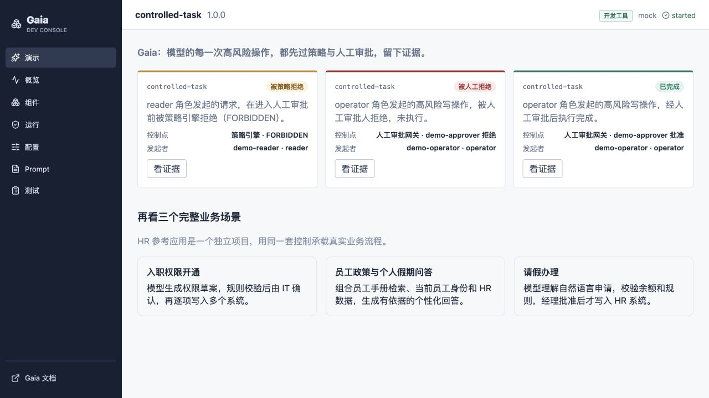

# 从三个 Case 理解 Gaia

Gaia 是面向应用开发者和交付工程师的受控执行框架。下面三个 Case 用具体业务界面展示框架行为，帮助你把抽象能力映射到代码、策略和 Runtime。

它们是参考应用，不是 Gaia 提供的开箱即用 HR 产品。

## Case 1：员工请假办理

{ .gaia-demo-recording }

员工输入一句自然语言请假需求，应用完成理解、规则检查、人工授权和 HRIS 写入。

| 参考应用中的行为 | 对应的 Gaia 能力 | 开发者需要实现 |
| --- | --- | --- |
| 识别病假、日期、天数和事由 | 场景中的模型调用 | Prompt、模型 Profile 和结构化输出 |
| 查询余额、员工状态和直属经理 | 只读工具调用 | HRIS 查询适配器与资源授权 |
| 检查日期、余额和资料完整性 | 确定性策略 | 业务规则、错误码和阻断条件 |
| 等待经理批准 | Human Gate | 风险声明、审批角色和展示载荷 |
| 批准后创建请假记录 | 受控写工具 | 幂等写入适配器和结果确认 |
| 保存发起人、决定和结果 | 审计投影 | 证据字段与客户可见页面 |

这个 Case 重点展示：**高风险写操作在可信审批之前不会进入适配器。**

## Case 2：新员工权限开通

HR 提交员工、岗位和部门信息。模型生成权限草案，规则检查敏感权限，IT 负责人确认后，Worker 逐项写入邮箱、代码仓库和业务应用。

| 场景难点 | Gaia 中的落点 |
| --- | --- |
| 一个请求要修改多个系统 | 场景编排多个工具 Command |
| 敏感权限需要 IT 决定 | 高风险工具触发 Human Gate |
| 某个系统暂时不可用 | Temporal Activity 重试与恢复 |
| 已成功的步骤不能重复执行 | Command 幂等键与结果确认 |
| Worker 发布时仍有旧 Run | Workflow 兼容性与 Worker 版本管理 |

这个 Case 重点展示：**一次跨系统任务可以持久执行、等待并从中断点恢复。**

## Case 3：员工制度与个人假期问答

员工询问“我还剩多少年假，是否可以跨年使用”。应用同时读取员工手册、当前身份和 HR 假期数据，再生成带依据的个性化回答。

| 场景难点 | Gaia 中的落点 |
| --- | --- |
| 制度知识和个人事实来自不同系统 | RAG 检索与只读业务工具组合 |
| 不同员工只能读取自己的数据 | 认证上下文、组织归属和资源授权 |
| 回答需要说明依据 | Citation 与模型调用证据 |
| 模型或检索服务异常 | 明确失败、重试预算与可观测性 |

这个 Case 重点展示：**模型上下文可以组合知识和实时事实，但权限控制仍由服务端执行。**

## 三种运行结果

{ .gaia-demo-recording }

Console 中的三条预置 Run 分别用于验证：

| 结果 | 框架行为 |
| --- | --- |
| `已完成` | 高风险写入经过可信批准后执行 |
| `被人工拒绝` | Gate 被拒绝，写适配器没有执行 |
| `被策略拒绝` | 请求在进入人工审批前被授权策略阻断 |

人工拒绝和策略拒绝是受控终态，不应被统计成 Runtime 故障。

## 这些 Case 证明什么

- Gaia 能承载读取、模型计算、策略、Human Gate 和外部写入组成的场景。
- API 与 Worker 可以分离部署，Run 可以跨进程等待和恢复。
- 身份、策略、审批、工具和结果可以形成统一证据。
- 业务适配器、模型和 Prompt 可以按项目替换。

## 这些 Case 不证明什么

- Gaia 不是 HR、CRM 或审批产品。
- Gaia 不提供面向业务人员的无代码搭建界面。
- 参考应用中的 Mock 数据和规则不能直接用于生产。
- 生产交付仍需接入企业身份、真实系统、密钥、监控和备份。

## 下一步

- 第一次运行框架：[20 分钟走通 Gaia](getting-started.md)
- 理解模块边界：[Gaia 全景图](architecture.md)
- 开始实现自己的场景：[开发者指南](developer-guide.md)
- 查看三个参考应用的完整流程：[HR 参考应用](showcase.md)
