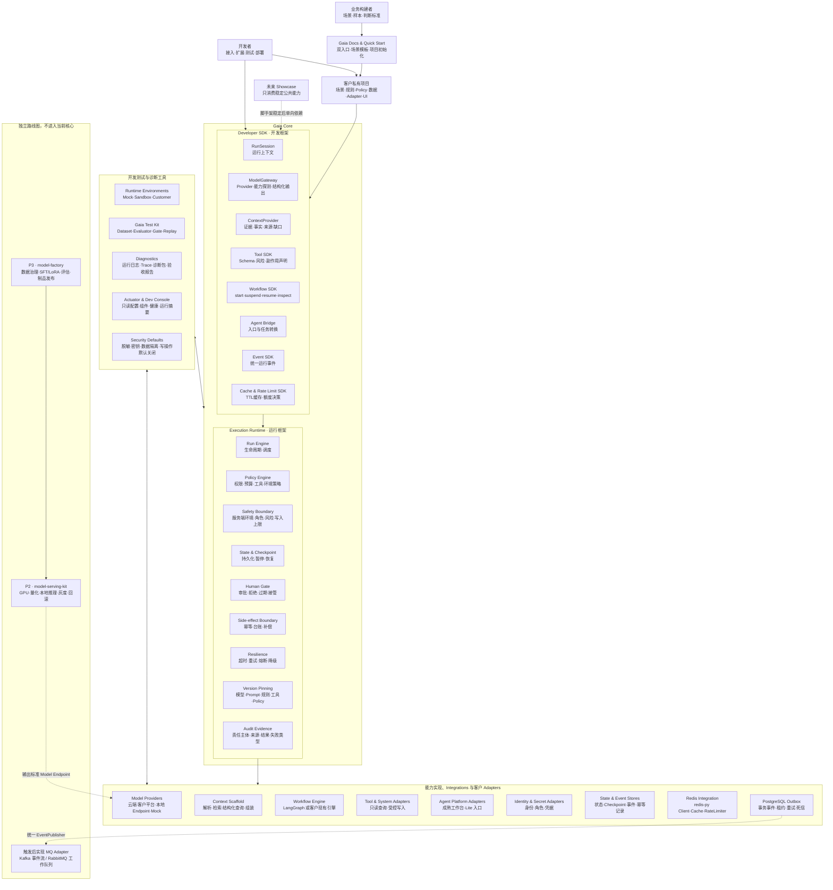
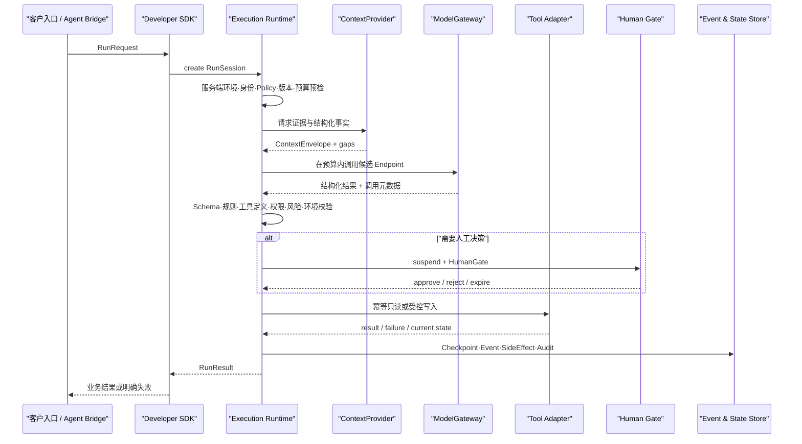

# Gaia 全景能力图

## 1. 一句话定义

Gaia 是 AI 时代的通用应用脚手架：业务构建者可以从场景模板验证简单 Demo，开发者通过
**Developer SDK** 完成接入和扩展，**Execution Runtime** 保证任务按被允许的方式运行，再由
Adapter 接入模型、Context、工具、身份和外部系统。

## 2. 两类用户入口

| 用户 | 首要问题 | 入口 | 产出 |
| --- | --- | --- | --- |
| 业务构建者 | 这个场景能做什么、值不值得继续 | Gaia 文档业务路径、Quick Start | 场景模板、样本、Demo 起点和待补资源 |
| 开发者 | 框架如何运行、怎样接入和扩展 | Gaia 文档开发路径、CLI、Python API | 可运行应用、真实 Adapter、测试和部署 |

两类用户共享同一个生成应用和 Runtime。业务构建者不操作底层组件；开发者不替业务方决定场景
价值、样本代表性和验收标准。

## 3. 全景分层

## 4. 两个核心框架的分工

| 问题 | Developer SDK | Execution Runtime |
| --- | --- | --- |
| 核心目标 | 让开发更快、更一致 | 让执行可控、可恢复、可追溯 |
| 面向谁 | AI 应用开发者 | 每一次真实 Run |
| 提供什么 | 类型、接口、客户端、声明式契约 | 生命周期、策略、状态、人工、副作用与审计 |
| 它不做什么 | 不做最终权限和高风险决策 | 不定义客户规则，不替代外部能力 |
| 两者关系 | 只通过 Runtime 执行有风险的调用 | 统一执行 SDK 声明的能力与围栏 |

## 5. 一次 Run 如何通过整套脚手架

## 6. P0 必须具备的能力

### 开发框架

- RunSession 和公共契约；
- ModelGateway + OpenAI-compatible Provider + Deterministic Mock；
- ContextProvider、Tool、Workflow、Agent Bridge、Event、Cache 和 RateLimiter 接口；
- 上层对 Provider、Workflow Engine 和客户 Adapter 实现无感。

### 运行框架

- Run 状态机与 Checkpoint；
- 不可绕过的 Policy 和权限检查；
- Human Gate 暂停与恢复；
- 幂等 SideEffectCommand；
- 超时、有限重试、熔断和降级；
- 版本固定、运行事件和审计证据。

### 开发与验证

- Mock / Sandbox / Customer 三档及环境绑定；Sandbox 是集成隔离，不是代码执行容器；
- `controlled-task` 合成测试流；
- 版本化 Dataset、确定性断言、可插拔 Evaluator/Gate 和批量回放；
- 健康检查、日志、Trace、诊断包和验收报告；
- Actuator 与可选 Dev Console 只读投影真实装配和运行状态。

## 7. 明确不进入 P0

- 任何具体行业、部门、客户或流程语义；
- 生产级多 Agent 平台与通信总线；
- 无治理、无 namespace 和权限边界的“通用 Agent Memory”；
- 复杂模型调度与 GPU 运维；
- 本地模型部署套件；
- SFT、LoRA、数据标注和模型工厂；
- 拖拽式平台、插件市场和多租户后台；
- 对 Showcase 的新功能或结构改造。
- 任意代码、Shell 或浏览器执行 Sandbox。
- 未出现多 Worker 或跨系统消费前的 Kafka/RabbitMQ Adapter。

## 8. 实现顺序

1. 固定公共契约和 `controlled-task` 合成测试流；
2. 实现 Run Engine、State、Policy、Human Gate 和 Side-effect Boundary；
3. 实现 ModelGateway、ContextProvider、Tool 和 Workflow 的最小调用链；
4. 用 Deterministic Mock 跑通全部正常与失败样本；
5. 接入一个真实 OpenAI-compatible Model Endpoint；
6. 补齐 Test Kit、Actuator、Dev Console 和诊断能力；
7. 增加 Redis Cache/RateLimiter 与 PostgreSQL Outbox；
8. 出现多 Worker 或跨系统消费后，再选择 Kafka 或 RabbitMQ Adapter；
9. 第二个真实场景出现后，再扩大其他 SDK 表面。

该顺序先保证运行围栏与完整闭环，再增加 Provider 和现场可用性，不从平台功能清单倒推实现。
