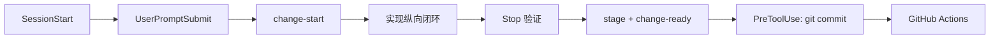

# 12 Agent 研发 SOP 与流水线

## 1. 目标

用户只需要讨论要改变的业务和产品事实。Agent 自己负责判断并同步实现、测试、使用文档、
生成契约、迁移和发布影响，不再依赖用户重复提醒。

Gaia 把一次完整变更定义为 Change Set：

```text
意图 + 行为契约 + 实现 + 测试 + 文档 + 生成物 + 发布影响
```

Codex Hook 约束 Agent 的工作过程；GitHub Actions 在干净环境验证结果。二者不能互相替代。

## 2. Agent 生命周期



### SessionStart 与 UserPromptSubmit

Hook 向 Agent 注入 `AGENTS.md` 和 `CONTRIBUTING.md` 的工作契约。只读讨论不创建 Change Set；
一旦要修改跟踪文件，Agent 必须执行：

```bash
make change-start INTENT="<可观察结果>" KIND=<kind>
```

### Stop

SessionStart 记录工作区基线。只有当前会话实际改变工作区时，Stop 才运行验证，避免用户只是讨论
时触发无关测试，也不会把会话开始前的用户修改算作 Agent 产物。

Stop 根据路径推导最低影响要求：

| 变化 | 最低要求 |
| --- | --- |
| `src/`、`scripts/` | 测试变化或有理由的豁免 |
| 公开 API、CLI、Config、Starter、Runtime | 使用文档和 CHANGELOG |
| `apps/web/src/` | Playwright、Console 文档和 CHANGELOG |
| `.codex/`、`.github/`、Makefile | 内部研发文档 |
| API 与 Contract | 重新生成 OpenAPI 且工作区无漂移 |

验证失败时 Stop 返回 `decision: block`，Codex 自动继续当前任务并根据失败原因补齐。为避免错误
配置造成无限循环，同一 Stop 已经续跑过一次时只显示阻断原因；提交 Hook 仍然保持硬门禁。

### PreToolUse

Agent 暂存目标文件后执行：

```bash
make change-ready
```

命令运行影响检查和必要的本地套件，并把 HEAD 与 staged tree 写入 Git 内部验证凭证。
`PreToolUse` 在任何 `git commit` 前重新计算 staged tree：

- 没有凭证：拒绝提交；
- 验证后又暂存文件：拒绝提交；
- HEAD 已改变：拒绝提交；
- 出现 `--no-verify`：拒绝提交。

### SubagentStop

承担实现任务的子 Agent 使用相同检查。只读 Reviewer 不改变 SessionStart 基线，因此不会被要求
制造无意义的测试或文档变更。

## 3. GitHub 权威验证

`ci.yml` 在 Pull Request 和 main push 上运行：

1. Python、Ruff、Mypy、确定性 pytest、文档与 OpenAPI；
2. Dev Console TypeScript 构建和 Playwright；
3. pgvector PostgreSQL 与 Redis 真实集成；
4. wheel/sdist 构建、干净环境安装、`gaia init`、生成项目测试。

研发阶段不配置 Nightly 和 Release workflow。带成本和网络波动的真实模型路径必须显式标记
`external`，同时设置 `RUN_EXTERNAL_TESTS=1` 和本地凭据后手工触发；普通本地测试、Pull Request
和 main push 不会因为环境中偶然存在 API Key 而调用外部服务。进入发布阶段后，再单独设计
定时回归、制品签名和可信发布流程。

## 4. 可信边界

Codex Hook 可以约束正常 Agent 生命周期，但不是完整安全边界：用户可以使用其他工具修改仓库，
本地信任也可能被撤销。GitHub Required Checks 才是合并权威门禁。

私有 GitHub 仓库连接完成后，需要把
`Python, contracts, and docs`、`Dev Console build and E2E`、
`PostgreSQL and Redis integration`、`Clean wheel and generated application` 配为 main 的
Required Checks。当前阶段不配置外部模型 Secret，也不对外发布制品。
