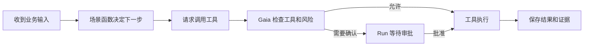

# function_task：第一次读 Gaia 示例

这个示例不是为了展示框架技巧，而是回答一个问题：

> 一段普通 Python 业务函数，怎样在不自己实现审批、恢复和审计的情况下，变成受控运行的 Gaia 场景？

## 先看业务链，不看类型



## 四个文件分别做什么

### `flows.py`：业务步骤

这里放场景函数。它读取当前输入和上一步结果，返回下一步业务意图。把它理解为“业务流程的大脑”，而不是 Runtime。

阅读时只问：输入是什么、返回什么、什么时候请求工具、什么算结束。

### `tools.py`：业务动作

这里放工具定义和适配器。工具定义描述动作名称、输入和副作用；适配器真正连接业务系统。

生产项目中，这一层通常会调用 CRM、ERP、内部 HTTP API 或数据库，而不是把客户数据存进 Gaia。

### `gaia.yaml`：控制规则

这里选择 Runtime、数据库和其他运行配置。工具是否允许使用、风险如何处理，也应由声明式配置或策略表达，而不是藏在 Prompt 里。

### `app.py`：组装入口

这里保持很薄，只负责调用 `gaia.build(...)`。如果这个文件开始出现审批循环、数据库锁或大量手工注册，说明职责放错了位置。

## 在本地运行

先启动与示例配置匹配的本地 Temporal Server：

```bash
uv run python scripts/temporal_dev_server.py \
  --host 127.0.0.1 \
  --port 7233 \
  --database var/gaia-function-task-temporal.db
```

这个示例使用 SQLite，因此不需要 `make infra-up`。该命令只启动 PostgreSQL 和 Redis，不启动
Temporal。

终端 A：

```bash
GAIA_API_KEY=gaia-dev-key \
uv run uvicorn examples.function_task.app:build --factory --reload
```

终端 B：

```bash
GAIA_API_KEY=gaia-dev-key \
uv run gaia worker \
  --config examples/function_task/gaia.yaml \
  --app examples.function_task.app:build
```

启动后通过 Gaia HTTP API 创建和查询 Run。第一次使用建议先完成文档中的 [20 分钟走通 Gaia](../../developer-docs/getting-started.md)，在 Console 中建立结果直觉，再回来看代码。

## 如何把它改成你的业务

按这个顺序，每次只改一层：

1. 复制示例目录，给场景换一个业务名称。
2. 把输入和输出换成真实业务字段。
3. 替换一个只读工具，先打通客户系统查询。
4. 为正常、未找到和上游错误写测试。
5. 再增加一个写工具，声明其副作用和风险。
6. 验证未批准前适配器没有执行。
7. 最后接入真实身份、策略、审计和观测配置。

不要从复制 Runtime、修改 Temporal Workflow 或新建一套 Run 表开始。

## 这个示例证明什么，不证明什么

它证明业务函数可以通过 Gaia 的标准组装路径运行，也证明 API 与 Worker 使用 Temporal Runtime。

它不代表生产系统已经完成身份提供方、密钥管理、数据库高可用、备份恢复、Worker 灰度发布和外部系统幂等设计。这些属于生产化工作，参见 [Gaia 全景图](../../developer-docs/architecture.md) 和 [生产化本地验证](../../developer-docs/production-like.md)。
